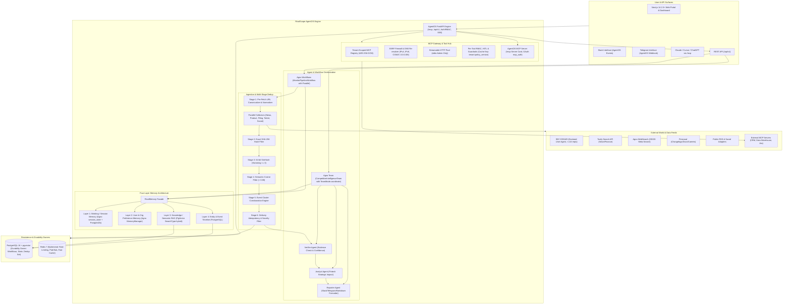
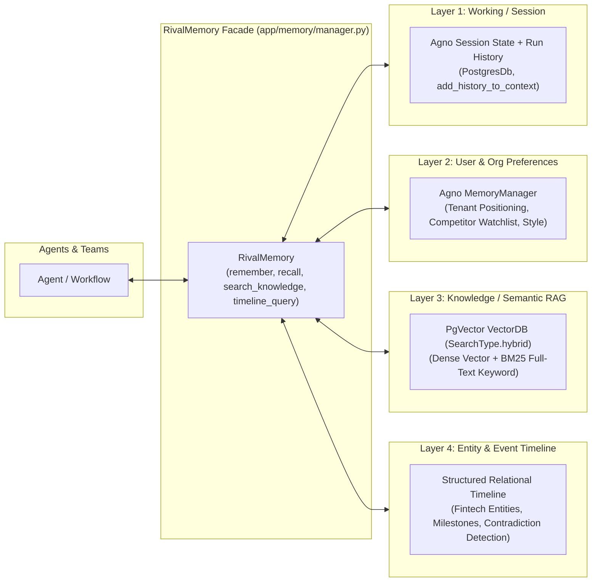
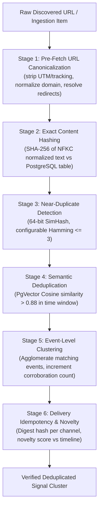

# RivalScope Architecture Specification

RivalScope is an enterprise-grade, open-source, self-hostable multi-agent Competitive Intelligence platform tailored for the fintech sector. It orchestrates autonomous agent teams, multi-layer memory, a 6-stage deduplication pipeline, and a bidirectional Model Context Protocol (MCP) gateway to track competitor moves across regulatory, product, financial, talent, and social vectors.

---

## 1. System Topology & Architecture

---

## 2. Agent Team Architecture & Modes

RivalScope employs a clean separation of concerns leveraging both **Agno Teams** and **Agno Workflows**:

1. **Agno Workflow (`MonitorPipelineWorkflow`)**:
   - Used for the deterministic, scheduled data collection pipeline.
   - Employs `Parallel` execution across 5 specialized collector agents:
     - `NewsScout`: Tavily news topic search + Agno WebSearch fallback.
     - `ProductWatcher`: Firecrawl diff crawler for product updates, changelogs, docs, pricing.
     - `FinanceAnalyst`: SEC EDGAR filings, quarterly earnings, funding announcements (strictly adhering to max 10 req/s and declared User-Agent).
     - `TalentSignals`: Careers pages, strategic job openings, public executive moves (strictly compliant; no unauthorized scraping).
     - `SocialPulse`: RSS feeds, public blogs, YouTube/X compliant adapters.
   - Collectors operate under the **principle of least-privilege**: they have strictly read-only capabilities and cannot mutate system state or invoke external write tools.
   - Feeds collected documents into the 6-stage Deduplication Pipeline.
   - Pushes deduplicated event clusters into `VerifierAgent` -> `AnalystAgent` -> `ReporterAgent` -> `DeliveryPipeline`.

2. **Agno Team (`CompetitiveIntelligenceTeam`)**:
   - Used for on-demand, interactive analytical inquiries using `TeamMode.coordinate`.
   - The team coordinator orchestrates specialized reasoning members:
     - Delegates evidence verification to `VerifierAgent`.
     - Queries `AnalystAgent` to generate strategic "so what" fintech implications.
     - Invokes `ReporterAgent` to format outputs with verified evidence citations.
     - Interfaces with `RivalMemory` for multi-layer memory access.
     - Dynamically acquires tenant MCP tools via callable factories keyed by `f"{tenant_id}:{policy_version}"`.

---

## 3. Four-Layer Memory Architecture (`RivalMemory`)

The memory system is encapsulated behind the **`RivalMemory`** facade (`backend/app/memory/manager.py`) to prevent namespace collisions with Agno's internal `MemoryManager`:

1. **Layer 1: Working/Session Memory**: Tracks conversation state across multi-turn interactions. Backed by Agno session storage (`PostgresDb`) and `session_state` scratchpads for intermediate computations.
2. **Layer 2: User/Org Memory**: Durable organization preferences, such as the host company's product positioning, prioritized competitor tiers, alert sensitivity thresholds, and custom report instructions (using Agno's `MemoryManager`).
3. **Layer 3: Knowledge / Semantic Memory**: High-dimensional vector store using PostgreSQL `pgvector` (`agno.vectordb.pgvector.PgVector`). Operates in **hybrid keyword + vector** mode using `SearchType.hybrid` (combining dense vector embeddings with PostgreSQL tsvector full-text keyword search). Also supports `SearchType.vector` and `SearchType.keyword`.
4. **Layer 4: Entity & Event Timeline Memory**: Structured temporal database storing entity-level state (competitor funding rounds, executive hires, product launches, pricing tier changes) for trend tracking, diff calculations ("what changed this week"), and contradiction detection.

---

## 4. Multi-Stage Deduplication Engine

To eliminate noise, RivalScope filters raw data through **six consecutive stages** with configurable thresholds and automated calibration tests:

- **Stage 1 (Pre-Fetch URL Canonicalization)**: Canonicalize URLs *before* fetching to save network bandwidth and avoid scraping the same asset through different referral query strings.
- **Stage 2 (Exact Content Hash)**: SHA-256 hash evaluated against a durable PostgreSQL unique table/set (`document_hashes`).
- **Stage 3 (SimHash Near-Duplicate)**: 64-bit SimHash with configurable Hamming distance threshold (`SIMHASH_HAMMING_THRESHOLD`, default: 3).
- **Stage 4 (Semantic Deduplication)**: Dense vector similarity with configurable cosine threshold (`SEMANTIC_COSINE_THRESHOLD`, default: 0.88) within a sliding time window.
- **Stage 5 (Event-Level Clustering)**: Agglomerates corroborating reports, tracks multi-source citations, and computes corroboration confidence.
- **Stage 6 (Delivery Idempotency & Novelty Scoring)**: Prevents repeated notifications across Slack/Telegram/email, gating alerts on a novelty score relative to Timeline Memory.

---

## 5. Storage Durability & Caching Architecture

| Responsibility | Durability Owner | Rationale |
| :--- | :--- | :--- |
| **Workflow Runs & Agent State** | **PostgreSQL 16 (AgentOS)** | ACID guarantees, transactional durability, and crash recovery. |
| **Deduplication Set & Hashes** | **PostgreSQL 16 (`document_hashes`)** | Eliminates dependency on Redis persistence. Vanilla Redis lacks Bloom filters without RedisBloom / Redis Stack. |
| **Vector & Keyword RAG** | **PostgreSQL 16 + `pgvector`** | Integrated transactional consistency alongside relational entities. |
| **Rate Limiting & Token Buckets** | **Redis 7** | Fast in-memory atomic increments (`INCR`, `EXPIRE`) for sliding window limits. |
| **Pub/Sub & Event Fanout** | **Redis 7** | Low-latency message distribution for SSE and background workers. |
| **Optional Fast Dedup Cache** | **RedisBloom (if Redis Stack active)** | Optional ephemeral accelerator; PostgreSQL remains authoritative. |

---

## 6. Model Context Protocol (MCP) Architecture

RivalScope implements bidirectional MCP:

### A. RivalScope Platform as an MCP Server
- Mounts at `/mcp` via Agno `AgentOS` and `MCPConfig`.
- Publishes standard server discovery card at `/mcp/server-card`.
- Secures transport with OAuth 2.0 (`mcp_auth`) bearer tokens and DNS rebinding protections (`allowed_hosts`).
- **Tenant Context Security**: Tenant identity is **strictly derived from the authenticated JWT claims / `user_id`**, never from an agent-supplied or tool parameter.

### B. Tenant MCP Gateway
- Allows tenants to connect internal enterprise MCP servers (Jira, Salesforce, PostgreSQL, Data Warehouses).
- **Transport Hardening**: `streamable-http` is enabled by default. `stdio` transport is **disabled by default and restricted to system administrators**.
- **SSRF Defense-in-Depth**:
  - Outbound requests are filtered against an extensive blocklist:
    - IPv4: `0.0.0.0/8`, `127.0.0.0/8`, `10.0.0.0/8`, `172.16.0.0/12`, `192.168.0.0/16`, `169.254.0.0/16` (AWS/GCP metadata)
    - CGNAT: `100.64.0.0/10`
    - IPv6: `::1/128`, `fc00::/7`, `fe80::/10`, `::ffff:0:0/96`
  - **DNS Re-resolution at Connect Time**: DNS is resolved immediately before socket connection to prevent DNS rebinding (TOCTOU attacks).
  - **Redirect Enforcement**: Blind redirects are forbidden; all HTTP 3xx redirect locations are validated against the SSRF firewall before being followed.
- **Callable Factory Caching**:
  - Agent tools are loaded dynamically using callable factories.
  - The cache key is strictly scoped to `f"{tenant_id}:{policy_version}"` (or `cache_callables=False`) to ensure immediate revocation when policies change.
- **Envelope Encryption**: Tenant MCP credentials are encrypted at rest using AES-256-GCM.

---

## 7. Security, Compliance & Governance

1. **Compliant Data Ingestion**:
   - **SEC EDGAR**: Strictly enforces maximum 10 requests per second with declared `User-Agent: Sample Company AdminContact@<sample company domain>.com`.
   - **Zero Unauthorized Scraping**: Explicitly forbids scraping authenticated or prohibited sites (e.g., LinkedIn).
2. **Prompt Injection Defense-in-Depth**:
   - **No Regex Stripping**: Brittle regex filtering is dropped as a primary defense.
   - **Architectural Least-Privilege**: Collectors reading untrusted external web content have zero write or mutation tools.
   - **Untrusted Content Enclosure**: Ingested data is encapsulated in explicit boundary delimiters (e.g. `<untrusted_source_content>`).
   - **Schema-Validated Outputs**: Agents emit strictly typed Pydantic models (`output_schema`), preventing hijacked natural language from dictating execution flow.
   - **Human-in-the-Loop (HITL)**: Any tool with write, mutative, or external side effects requires explicit operator approval before execution.
3. **Multi-Tenancy & RBAC**:
   - All database tables, vector indexes, and caches are partitioned by `tenant_id`.
   - Role-Based Access Control (`admin`, `analyst`, `viewer`) enforced at API and tool levels.
4. **Offline Demo & Testing via `MockModel`**:
   - Complete offline execution without external LLM API dependencies using `MockModel`, simulating deterministic agent responses, structured JSON outputs, and collector mocks.
5. **Observability, Cost Controls & Evals**:
   - Per-tenant token budgets and quota enforcement.
   - Automated evaluation suite checking retrieval precision/recall, citation accuracy, and dedup calibration.
