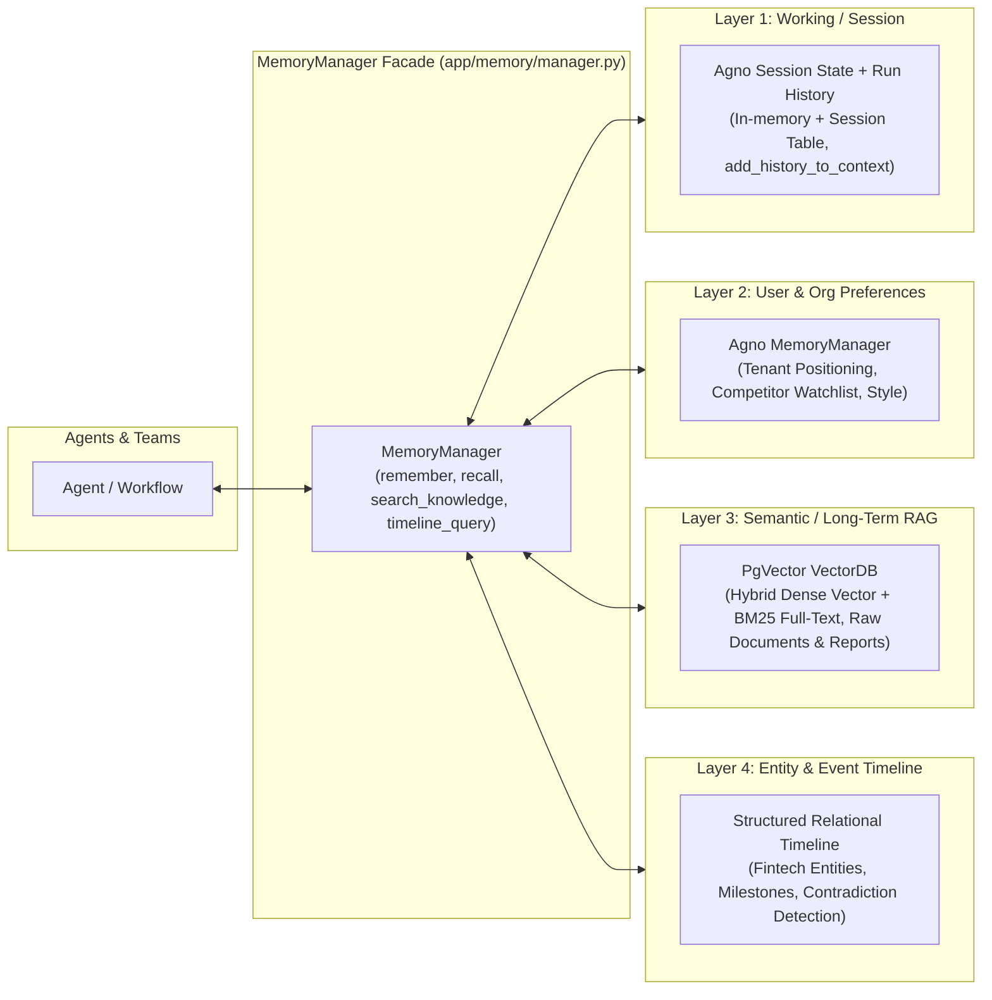
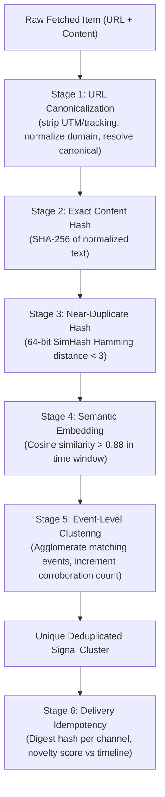

# RivalScope Architecture Specification

RivalScope is an enterprise-grade, open-source, self-hostable multi-agent Competitive Intelligence platform tailored for the fintech sector. It orchestrates autonomous agent teams, multi-layer memory, multi-stage deduplication, and a bidirectional Model Context Protocol (MCP) gateway to track competitor moves across regulatory, product, financial, talent, and social vectors.

---

## 1. System Topology & Architecture

```mermaid
flowchart TB
    subgraph External["External World & Data Feeds"]
        SEC["SEC EDGAR / Regulatory APIs"]
        TAV["Tavily Search API (News/Finance)"]
        WEB["Agno WebSearch (DDGS Meta-Search)"]
        FC["Firecrawl (Changelogs/Docs/Careers)"]
        RSS["Public RSS & Social Adapters"]
        ExtMCP["External MCP Servers (CRM, Data Warehouse, Jira)"]
    end

    subgraph Presentation["User & API Surfaces"]
        WebUI["Next.js 14 Web Portal & Dashboard"]
        SlackInt["Slack Interface (AgentOS Events)"]
        TgInt["Telegram Interface (AgentOS Webhook)"]
        MCPClient["Claude / Cursor / ChatGPT via /mcp"]
        RestAPI["REST API (/api/v1)"]
    end

    subgraph Core["RivalScope AgentOS Engine"]
        Gateway["AgentOS FastAPI Engine (/mcp, /api/v1, Auth, SSE)"]
        
        subgraph Pipeline["Ingestion & Multi-Stage Dedup"]
            Collectors["Parallel Collectors (News, Product, Filing, Talent, Social)"]
            Canon["URL Canonicalizer & Normalizer"]
            HashDedup["Exact Hash (SHA-256) & SimHash Filter"]
            SemDedup["Semantic Embedding & Cosine Clustering"]
            ClusterMgr["Event Cluster Corroboration Engine"]
        end

        subgraph Orchestration["Agent & Workflow Orchestration"]
            Workflows["Agno Workflows (Batch Monitor & Deep-Dive)"]
            TeamOrch["Agno Team (TeamMode.coordinate)"]
            Verifier["Verifier Agent (Evidence Check & Confidence)"]
            Analyst["Analyst Agent (Fintech Strategic Impact)"]
            Reporter["Reporter Agent (Slack/Telegram/Markdown Formatter)"]
        end

        subgraph MemorySystem["Four-Layer Memory Architecture"]
            MemFacade["MemoryManager Facade"]
            WorkingMem["Layer 1: Working / Session Memory"]
            OrgMem["Layer 2: User & Org Preference Memory"]
            SemanticMem["Layer 3: Knowledge / Semantic RAG (pgvector)"]
            TimelineMem["Layer 4: Entity & Event Timeline (PostgreSQL)"]
        end

        subgraph MCPGatewaySub["MCP Gateway & Tool Hub"]
            MCPReg["Tenant-Scoped MCP Registry"]
            SSRF["SSRF Firewall & DNS Validator"]
            ClientPool["Streamable HTTP / stdio Client Pool"]
            PolicyEngine["Per-Tool RBAC, HITL & Guardrails"]
            MCPPublish["AgentOS MCP Server (/mcp Server Card)"]
        end
    end

    subgraph Storage["Persistence & Caching"]
        PG[("PostgreSQL 16 + pgvector")]
        Redis[("Redis 7 (Rate Limit, Bloom, Cache, Queue)")]
    end

    %% Connections
    Presentation --> Gateway
    Gateway --> RestAPI
    Gateway --> MCPPublish
    RestAPI --> Workflows
    RestAPI --> TeamOrch
    Workflows --> Collectors
    Collectors --> External
    Collectors --> Canon --> HashDedup --> SemDedup --> ClusterMgr
    ClusterMgr --> Storage
    ClusterMgr --> Verifier --> Analyst --> Reporter
    TeamOrch --> Verifier
    TeamOrch --> Analyst
    TeamOrch --> Reporter
    TeamOrch --> MemFacade
    Workflows --> MemFacade
    MemFacade --> WorkingMem
    MemFacade --> OrgMem
    MemFacade --> SemanticMem
    MemFacade --> TimelineMem
    SemanticMem --> PG
    TimelineMem --> PG
    Gateway --> MCPGatewaySub
    MCPGatewaySub --> ExtMCP
    Gateway --> Storage
```

---

## 2. Agent Team Architecture & Modes

RivalScope employs a hybrid architecture leveraging both **Agno Teams** and **Agno Workflows**:

1. **Agno Workflow (`MonitorPipelineWorkflow`)**:
   - Used for the deterministic, scheduled data collection pipeline.
   - Employs `Parallel` execution across the 5 specialized collector agents:
     - `NewsScout`: Tavily news topic search + Agno WebSearch fallback.
     - `ProductWatcher`: Firecrawl diff crawler for product updates, changelogs, docs, pricing.
     - `FinanceAnalyst`: SEC EDGAR filings, quarterly earnings, funding announcements.
     - `TalentSignals`: Careers pages, strategic job openings, public executive moves (strictly compliant; no LinkedIn scraping).
     - `SocialPulse`: RSS feeds, public blogs, YouTube/X compliant adapters.
   - Normalizes collected documents into `RawDocument` schemas.
   - Pushes documents through the 5-stage Deduplication Pipeline.
   - Feeds deduplicated event clusters into the `VerifierAgent` -> `AnalystAgent` -> `ReporterAgent` -> `DeliveryPipeline`.

2. **Agno Team (`CompetitiveIntelligenceTeam`)**:
   - Used for the on-demand, interactive analytical interface (`TeamMode.coordinate`).
   - The team leader coordinates specialized reasoning members:
     - Delegates evidence verification to `VerifierAgent`.
     - Queries `AnalystAgent` to generate strategic "so what" fintech implications.
     - Invokes `ReporterAgent` to format responses with verified evidence citations.
     - Directly interfaces with `MemoryManager` and tenant MCP tools via dynamic callable factories.

---

## 3. Four-Layer Memory Architecture

1. **Layer 1: Working/Session Memory**: Tracks conversation state across multi-turn interactions. Backed by Agno session storage, checkpointing, and `session_state` scratchpads for transient calculations.
2. **Layer 2: User/Org Memory**: Durable organization preferences, such as the host company's product positioning, prioritized competitor tiers, alert sensitivity thresholds, and custom report instructions.
3. **Layer 3: Knowledge / Semantic Memory**: High-dimensional vector store using PostgreSQL `pgvector`. Provides hybrid search (BM25 keyword search + vector cosine distance) over historical news, filings, and generated intelligence reports.
4. **Layer 4: Entity & Event Timeline Memory**: Structured temporal database storing entity-level state (competitor funding rounds, executive hires, product launches, pricing tier changes) for trend tracking, diff calculations ("what changed this week"), and contradiction detection.

---

## 4. Multi-Stage Deduplication Engine

To eliminate noise, RivalScope filters raw data through five consecutive stages:

---

## 5. Model Context Protocol (MCP) Architecture

RivalScope implements bidirectional MCP:

### A. RivalScope Platform as an MCP Server
- Mounts at `/mcp` via Agno `AgentOS` and `MCPConfig`.
- Exposes core capabilities to external AI clients (Claude Desktop, Cursor, ChatGPT, Claude Code):
  - `get_latest_signals`: Retrieve normalized competitive signals with citations.
  - `get_competitor_timeline`: Retrieve temporal evolution of competitor actions.
  - `generate_report`: Trigger synthesis workflows on demand.
  - `list_competitors`: Discover configured competitor metadata.
  - `run_monitor_now`: Request on-demand collection cycle.
- Publishes standard server discovery card at `/mcp/server-card`.
- Secures transport with token authorization gate and DNS rebinding protections (`allowed_hosts`).

### B. Tenant MCP Gateway
- Enables organizations to register their private MCP servers (e.g., Salesforce, Jira, internal Postgres, internal BI tools).
- Features:
  - **Tenant Scoping**: Isolated tool registrations per organization.
  - **SSRF Protection**: Strict IP filtering blocking loopback (`127.0.0.1`), link-local (`169.254.169.254`), private RFC1918 subnets (`10.0.0.0/8`, `172.16.0.0/12`, `192.168.0.0/16`) unless whitelisted.
  - **Envelope Encryption**: Secrets and authorization tokens encrypted with AES-256-GCM using tenant master keys.
  - **Dynamic Injection**: Injected into Agno agents at runtime using callable factories (`tools=callable_tools_factory`), ensuring zero cross-tenant tool leakage.
  - **Audit Logging**: Every tool invocation recorded with latency, caller, input parameters, and output token sizes.

---

## 6. Security, Compliance & Data Governance

1. **No Forbidden Scraping**: Explicit ban on unauthorized scrapers (e.g. LinkedIn). All signals sourced from official SEC EDGAR APIs, RSS feeds, public changelogs/press releases via Firecrawl with respectful robots.txt parsing and per-domain rate limits.
2. **Prompt Injection Defense**: All fetched external content is treated as untrusted data strings, wrapped in XML delimiter tags, and stripped of direct imperative prompt directives.
3. **Multi-Tenancy**: All database queries, memory lookups, and MCP connections are partitioned by `tenant_id`.
4. **Air-Gapped & Offline Capability**: Every provider interface includes a deterministic mock implementation (`MockSearchProvider`, `MockCrawlProvider`, `MockFilingsProvider`, `MockSocialProvider`, `MockNotifier`) allowing 100% test coverage and offline demo mode with zero API keys required.
